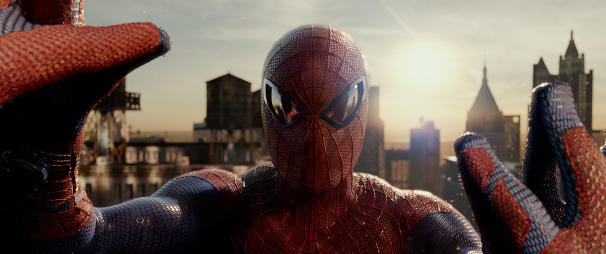

{:class="img-responsive"}

# Computer Graphics
{: .no_toc }

Node graphs are very popular in the movie and game industries. They form the architectural back-bone of many digital content creation applications sold by companies such as SideFX, Autodesk and Foundry.

Digital artists at film and game studios have often graduated from animation schools, where they learn how to use node graph based interface in many of these applications.

[Top 50 Animation Schools and Colleges in the U.S. - 2020](https://www.animationcareerreview.com/articles/top-50-animation-schools-and-colleges-us-2020-college-rankings)

Guides on node graph user interfaces for digital content creation.

* [Katana, Foundry](https://learn.foundry.com/katana/Content/ug/node_graph.html)
* [Houdini, SideFX](https://www.sidefx.com/docs/houdini/network/layout.html)
* [Nuke, Foundry](https://learn.foundry.com/nuke/content/getting_started/meet_nuke/key_concepts.html)
* [Mari, Foundry](https://learn.foundry.com/mari/Content/user_guide/node_graph/node_graph_intro.html)
* [Maya, Autodesk](https://knowledge.autodesk.com/support/maya/learn-explore/caas/CloudHelp/cloudhelp/2020/ENU/Maya-Basics/files/GUID-92F35EC2-35BF-49AB-8CDE-9DE922EA85A1-htm.html)
* [Blender](https://docs.blender.org/manual/en/latest/editors/shader_editor.html)