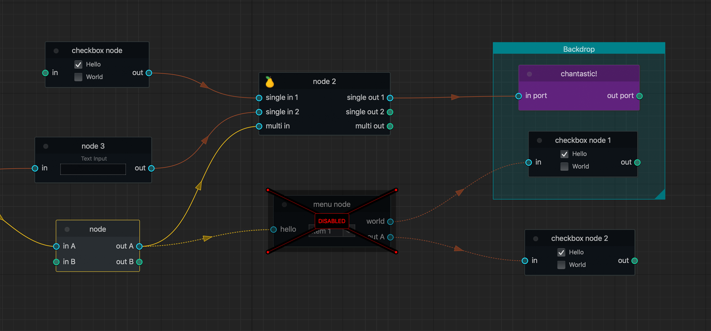

{:class="img-responsive"}

# Debates
{: .no_toc }

Node graphs are a subset of visual programming paradigms. There have been a number of debates on whether visual programming or node graphs are useful to users. 

* [Discussion on Hacker News, 2014](https://news.ycombinator.com/item?id=7274674) 
* [Discussion on Hacker News, 2019](https://news.ycombinator.com/item?id=19025639)
* [Reddit discussion, 2019](https://www.reddit.com/r/programming/comments/9kgk75/visual_programming_why_its_a_bad_idea/)

