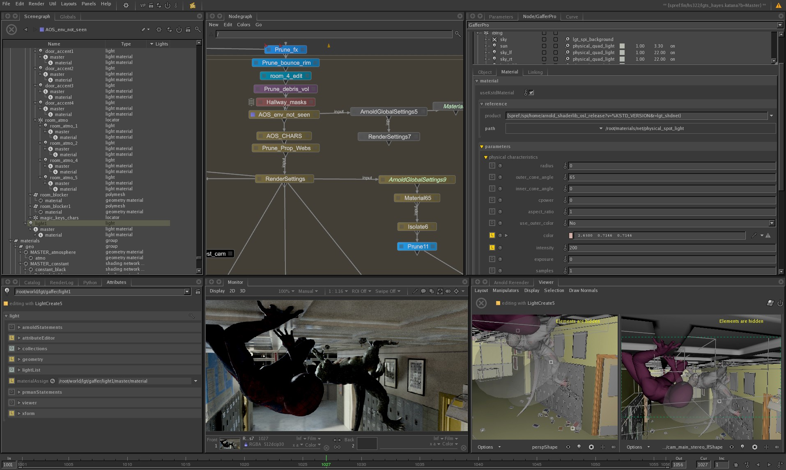

{:class="img-responsive"}

# Definitions
{: .no_toc }

## Node Graph

A node graph is graph of connected nodes. A node graph has a visual representation as as a non-visual or functional implementation. These two representations are often kept orthogonal or separate from each other, in order to organize the code according to areas of concern and keep source code from getting entangled with areas of no concern.

## Connection, Wire or Link

A connection, wire or link describes how data output from a node is passed to the inputs of another node. 
* Visually this connection is drawn with lines or curves. 
* Functionally, in the source code the connection is often implemented by holding onto pointers or memory addresses of the source or destination of the connection.

## Inputs

An input represents the input value to a node's computation. Often nodes will have many inputs. 
* Visually the inputs are often represented by circles. 
* Functionally, in the source code the input is often represented by pointers to memory space where output values from other nodes are stored. This memory space is often referred to by using pointer variables.

## Outputs

An output represents the output value resulting from a node's computation. Often nodes will have many outputs. 
* Visually the outputs are often represented by circles.
* Functionally, in the source code the output is often represented by memory space which holds the actual output values.

## Node and Compute

A node often has many inputs and outputs. A node's purpose is to perform some computation on its inputs in order to produce some outputs. It can be thought of as mathematical operation which operates on it inputs to produce the outputs. A node can also avoid performing its computation if it knows that it is already up to date. Whether a node is up to date, can be tracked using dirty state propagation techniques, where any input changes upstream will propagate the dirty state downstream.
* Visually nodes are often represented by rectangles.
* Functionally, in the source code the node performs some exectuable logic that transforms the inputs values into updated output values on the node.

## Parameters

A parameter on a node is a user adjustable parameter that affects how the node operates on its inputs to produce its outputs. They are very similar in concept to inputs on a node, except they store values as opposed to pointing or referencing other values. 
* Visually, parameters often do not appear in the node graph. However when a user edits a node, the parameters often open up in another editor. 
* Functionally, in the source code the parameter can be presented as a node with no inputs and simply outputs a value that another input on another node can link to. Another alternative implementation is a new sub type of input that can also hold onto its values when it is not connected to any output from another node.

## Group Node

A group node is used to simplify complex graphs by hiding subgraphs inside of itself and only exposing some of the inputs and outputs to the subgraph. A group node acts like a normal node except that it's internal computation is represented by another hidden node graph.
* Visually, group nodes appear as regualr nodes with inputs and outputs. However, in the user interface it is also possible to dive into the subgraph inside the group node and make adjustments to it.
* Functionally, in the source code, group nodes act similar to another function call. When all the inputs leading into the group node have been evaluated it becomes possible to evaluate the subgraph inside the group node.

## Wikipedia

For more details, please see the following Wikipedia articles written by the author.
They define node graphs, their operating components and how they are used in software applications today. 

* [Node graph architecture](https://en.wikipedia.org/wiki/Node_graph_architecture)
* [Node graph](https://en.wikipedia.org/wiki/Node_graph_architecture#Node_Graph)

