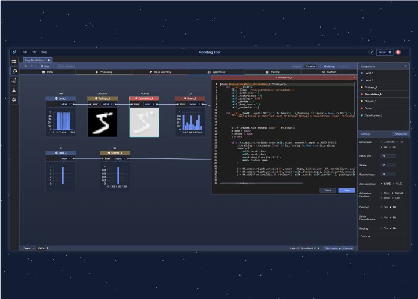

{:class="img-responsive"}

# Machine Learning
{: .no_toc }

Node graphs have recently become a popular way to visualize and control neural networks used machine learning. A node in the node graph is often used to represent a layer in the nerual network.

The follwoing are the 2 most popular deep learning frameworks. They don't provide a graphical user interface for the layers in the neural networks.

* [PyTorch, GitHub, Facebook](https://pytorch.org)
* [TensorFlow, GitHub, Google](https://www.tensorflow.org)

The following are some examples of applications providing graphical node graph interfaces to make it easier to design and debug neural networks.

* [PerceptiLabs, KDnuggets](https://www.kdnuggets.com/2020/10/perceptilabs-gui-visual-api-tensorflow.html)
* [Deep Cognition, Deep Congition Inc](https://deepcognition.ai)
* [Neural Network Modeler, IBM](https://mediacenter.ibm.com/media/Watson+Studio+Neural+Network+Modeler/0_1lgka1w6/117180202)
* [Neural Network Console, Sony](https://dl.sony.com)
* [Digits, nVIDIA](https://developer.nvidia.com/digits)

