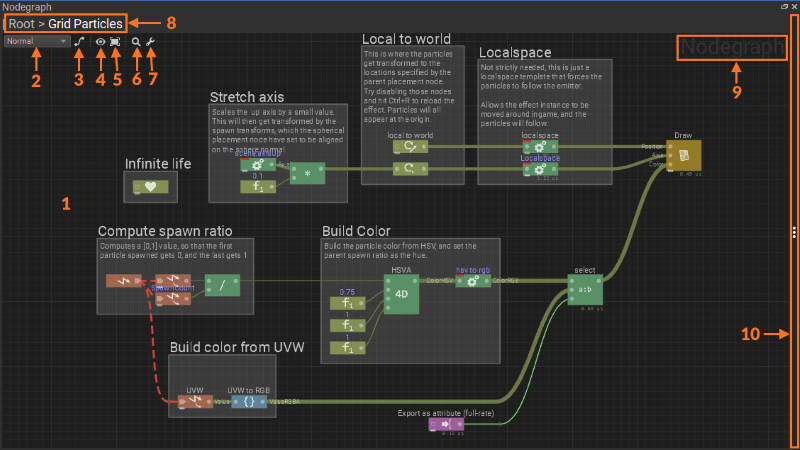

{:class="img-responsive"}

# Other Uses
{: .no_toc }

The following is a list of other interesting projects using node graphs. Many of these are involved with film and television media as well as with video game production. 

## Film and Video
* [Octane Node Graph in OctaneRender](https://unity.otoy.com/guides/new-working-octane-materials/)
* [Pixar USD Node Graph](https://graphics.pixar.com/usd/docs/api/node_graph_8h.html)
* [Gaffer Node Graph](https://www.gafferhq.org/documentation/0.53.4.0/WorkingWithTheNodeGraph/Box/index.html)
* [Guerilla Render Node Graph](http://guerillarender.com/doc/1.4/User%20Guide_User%20Interface_Node%20Graph.html)
* [Mewa Node Graph](https://en.wikibooks.org/wiki/Mewa_User%27s_Guide/Using_the_Node_Graph)
* [Natron Node Graph](https://natron.readthedocs.io/en/rb-2.3/devel/groups.html#:~:text=A%20group%20can%20be%20created,node%20and%20one%20Input%20node.&text=In%20Natron%2C%20a%20node%20has,will%20be%20taken%20into%20account.)
* [Notch Node Graph](http://manual.notch.one/0.9.21/en/topic/user-interface-nodegraph)

## Games
* [Nodegraph - Valve Developer Community](https://developer.valvesoftware.com/wiki/Nodegraph)
* [Uneal Node Graph and Blueprints](https://www.youtube.com/watch?v=j6mskTgL7kU)
* [Godot Node Graph](https://www.youtube.com/watch?v=ZD9X3uvyWmg)
* [PopcornFX Node Graph](https://www.popcornfx.com/docs/popcornfx-v2-7/editor/effect-editor-panel-overview/nodegraph/) 

## Graphics and Web
* [Nodes.io Node Graph](https://nodes.io/)
* [Cytoscape Node Graph](https://js.cytoscape.org/)

## Robots and Operating Systems
* [ROS2 Node Graph API](https://docs.ros2.org/bouncy/api/rclcpp/classrclcpp_1_1node__interfaces_1_1_node_graph.html)

## 3D Scanning and Geomtry
* [R3DSWrap Node Graph](https://www.russian3dscanner.com/docs/Wrap3/NodeGraphEditor/NodeGraphEditor.html)

## Graphing and Geomtry
* [GeoGebra Node Graph](https://www.geogebra.org/m/uff55Z2S)
* [Antimony Node Graph](https://www.mattkeeter.com/projects/antimony/3/)

## VR and Chat
* [Udon Node Graph](https://docs.vrchat.com/docs/udon-node-graph-upgrade)
* [VRChat Node Graph](https://medium.com/@vrchat/vrchat-node-graph-playmaker-and-soon-1a958672688d)

