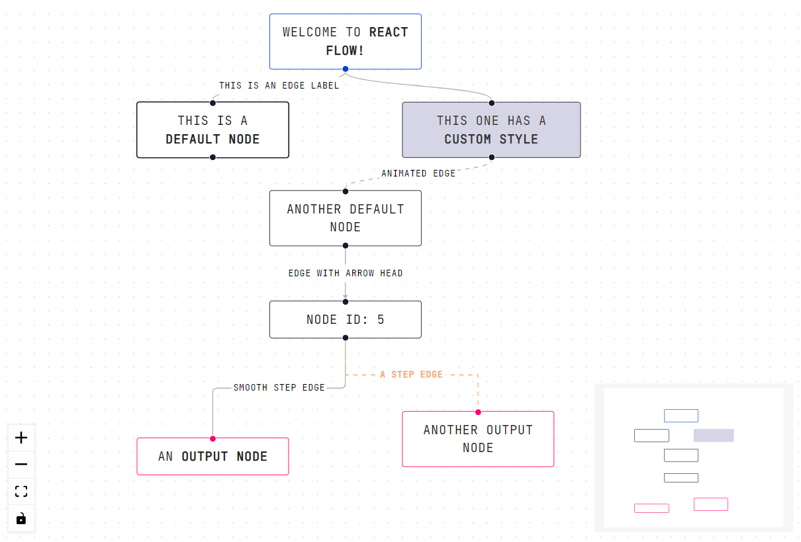

{:class="img-responsive"}

# Overview
{: .no_toc }

If you use [Node](https://nodejs.org) and [React](https://reactjs.org/), [React Flow](https://reactflow.dev/) is one of the best node graph implementations available. It allows you to build simple static node graphs to more complicated and interactive node graphs in a very intuitive way. It allows you to style the node graph in many different ways. For examples colors, font size, line and wire styles, etc. It also allows you to build your own custom node types.

## Resources
* [React Flow](https://reactflow.dev/)
* [React Flow Setup](https://reactflow.dev/docs/getting-started/)
* [React Flow Examples](https://reactflow.dev/examples/)
* [NodeJS](https://nodejs.org)
* [React](https://reactjs.org/)

