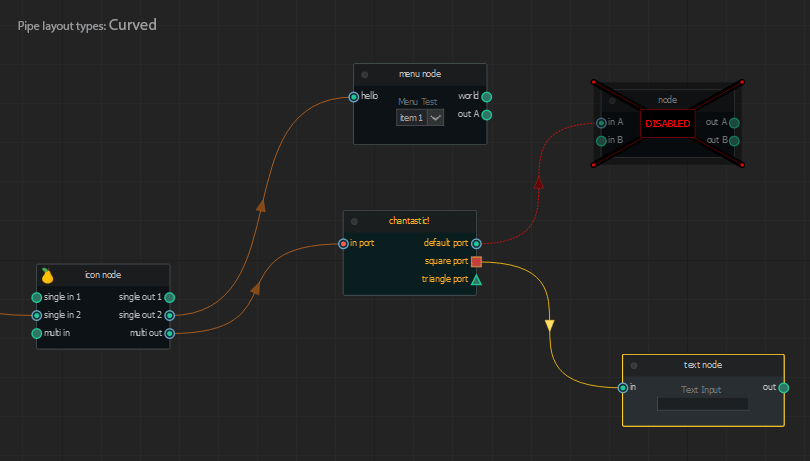

{:class="img-responsive"}

# Source Code
{: .no_toc }

Node graphs have become very popular even in open source applications. Here we highlight a few projects which we feel cleanly defines each component needed to create a full working node graph. 

* [alelievr/NodeGraphProcessor](https://github.com/alelievr/NodeGraphProcessor) 
* [jchanvfx/NodeGraphQt](https://github.com/jchanvfx/NodeGraphQt)
* [martin-pr/possumwood](https://github.com/martin-pr/possumwood)
* [dsideb/nodegraph-pyqt](https://github.com/dsideb/nodegraph-pyqt)
* [lifeisforu/NodeGraph](https://github.com/lifeisforu/NodeGraph)

