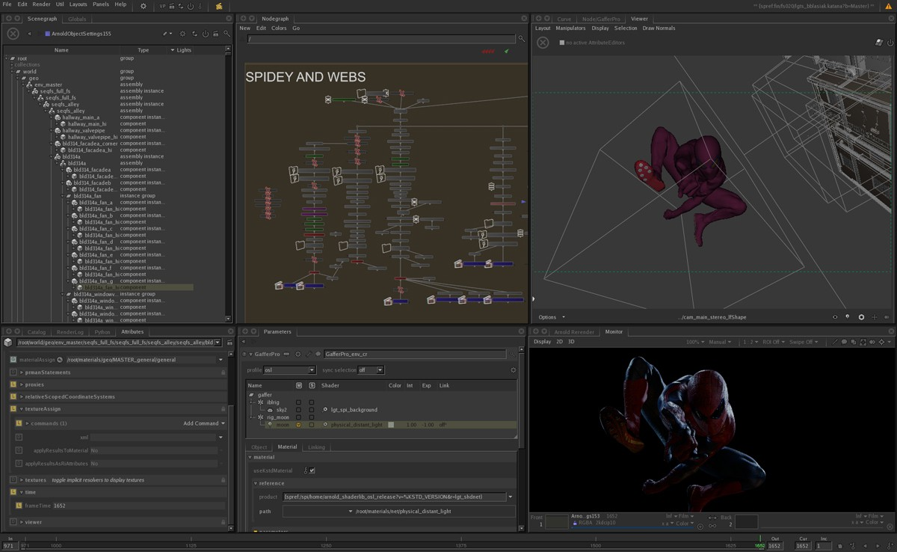

{:class="img-responsive"}

# User Interface
{: .no_toc }

With the explosion of node graphs in many different applications, the user interface to the node graph has become a very important consideration. 

* [Node graphs on dribble](https://dribbble.com/rfksna/collections/3268905-Node-Graph)
* [Nodes on dribble](https://dribbble.com/tags/nodes)

Snapshots of node graphs in many different applications over many years.

* [Visual Programming Languages - Snapshots](http://blog.interfacevision.com/design/design-visual-progarmming-languages-snapshots)

Guides on node graph user interfaces for digital content creation.

* [Katana, Foundry](https://learn.foundry.com/katana/Content/ug/node_graph.html)
* [Houdini, SideFX](https://www.sidefx.com/docs/houdini/network/layout.html)
* [Nuke, Foundry](https://learn.foundry.com/nuke/content/getting_started/meet_nuke/key_concepts.html)
* [Mari, Foundry](https://learn.foundry.com/mari/Content/user_guide/node_graph/node_graph_intro.html)
* [Maya, Autodesk](https://knowledge.autodesk.com/support/maya/learn-explore/caas/CloudHelp/cloudhelp/2020/ENU/Maya-Basics/files/GUID-92F35EC2-35BF-49AB-8CDE-9DE922EA85A1-htm.html)
* [Blender](https://docs.blender.org/manual/en/latest/editors/shader_editor.html)
