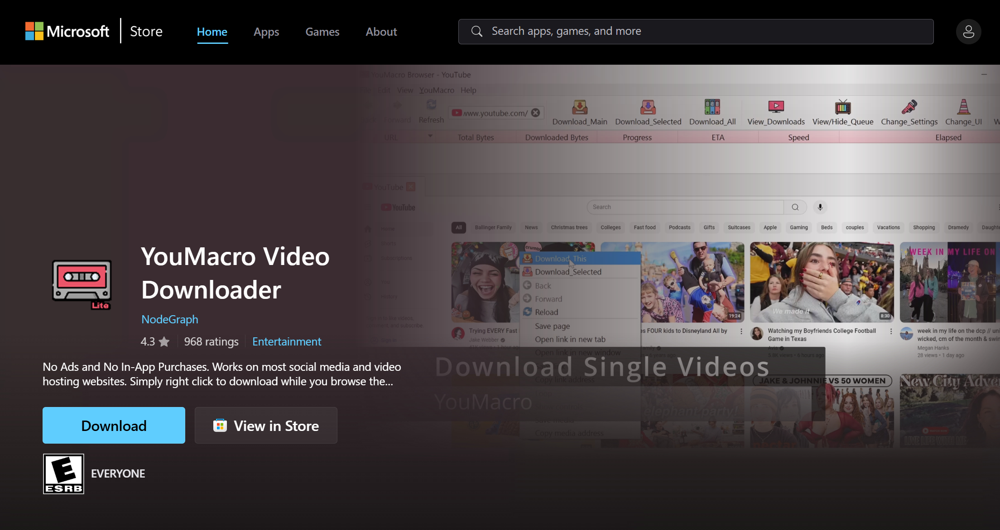

<!-- <iframe width="560" height="315" src="https://www.youtube.com/embed/jQK533nctjA" title="YouTube video player" frameborder="0" allow="accelerometer; autoplay; clipboard-write; encrypted-media; gyroscope; picture-in-picture" allowfullscreen></iframe> -->

[{:class="img-responsive"}](https://apps.microsoft.com/detail/9nlwcwnh9whl){:target="_blank"}

# Overview
{: .no_toc }

YouMacro is an application that was intended to let users visually configure macros to automate IOT devices and automate getting information from web browsers. Since then YouMacro has evolved to its modern use at [www.youmacro.com](https://youmacro.com), where it no longer visually presents a node graph.  However for this case study we will look look at an early version of YouMacro which used node graphs.  

YouMacro favors composition over inheritance to organize code. The [entities framwork](https://github.com/nodegraph/ngsinternal/tree/master/src/entities) defines this composition framework. The main node graph components are defined in the [compshapes](https://github.com/nodegraph/ngsinternal/tree/master/src/components/compshapes) subfolder.

The following are the projects which constituted the early versions of YouMacro.
* [ngsbase](https://github.com/nodegraph/ngsbase) 
* [ngsinternal](https://github.com/nodegraph/ngsinternal)
* [ngsexternal](https://github.com/nodegraph/ngsexternal)
* [ngsrelease](https://github.com/nodegraph/ngsrelease)

The author's GitHub and GitLab repos can be found at the following links.
* [nodegraph, GitHub](https://github.com/nodegraph)
* [nodegraph, GitLab](https://gitlab.com/nodegraph)
